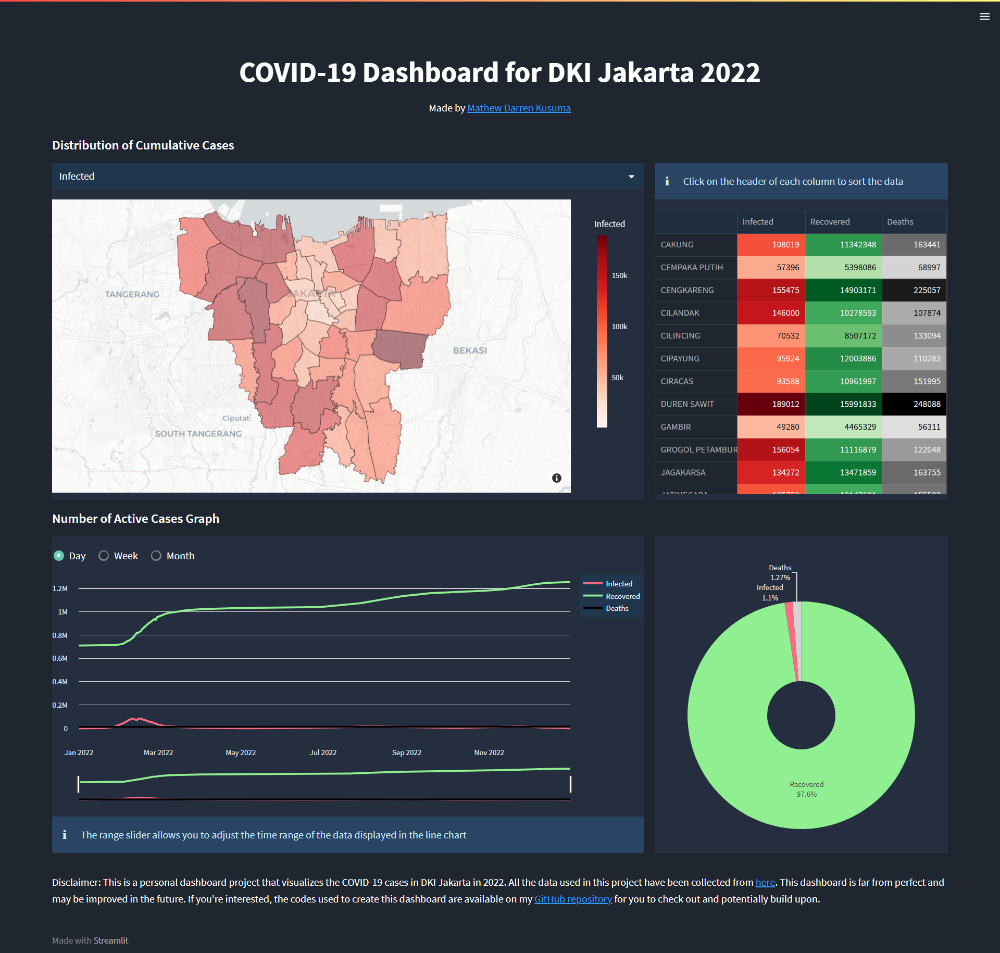
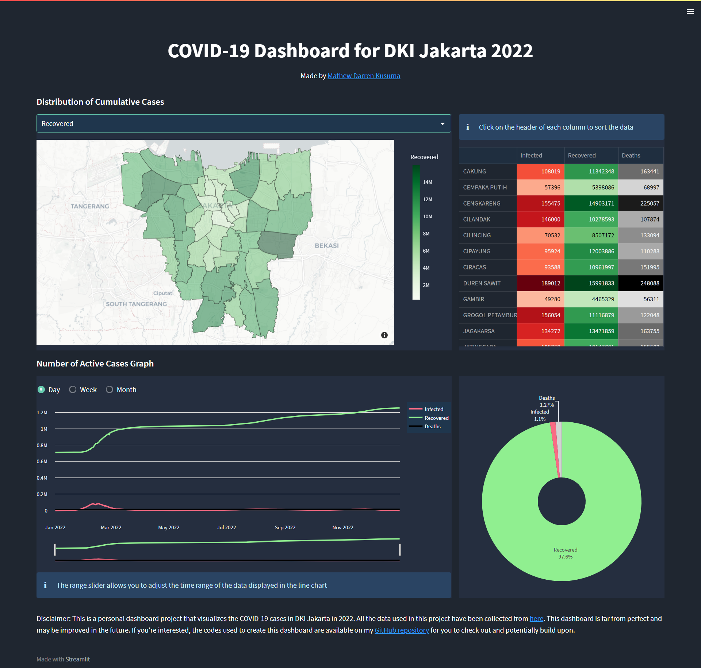
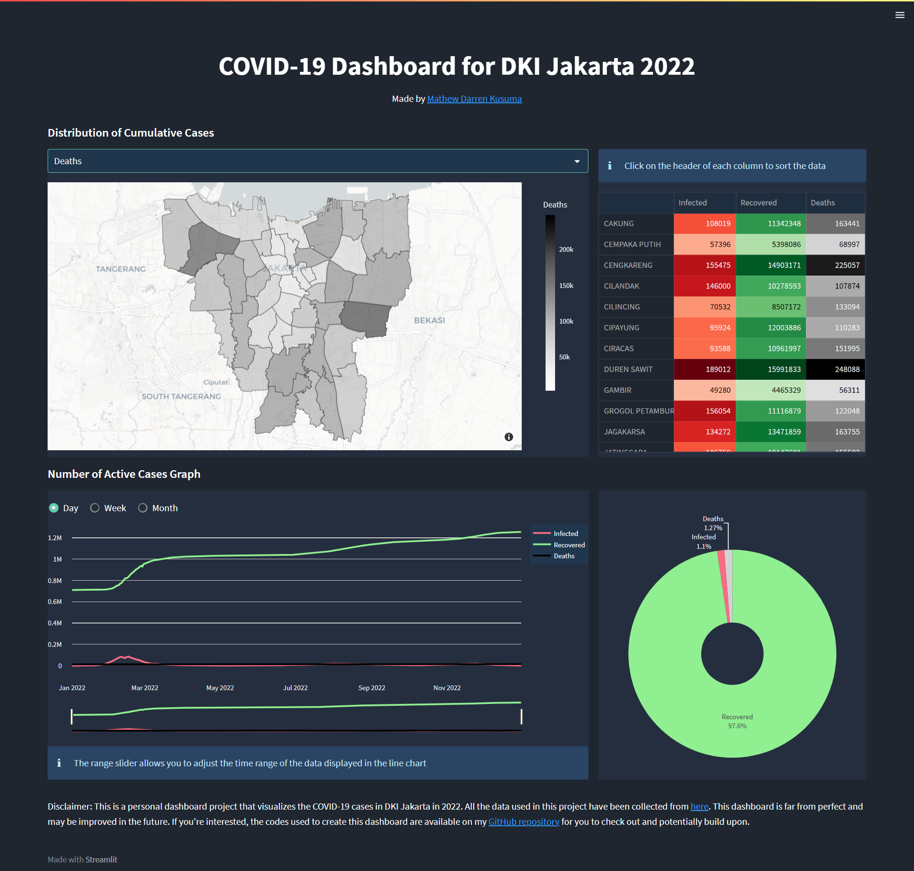

<h1 align="center">
    COVID-19 Dashboard for DKI Jakarta 2022
</h1>

    

    
    
     

This project is a dashboard that displays COVID-19 cases in the Jakarta area in 2022, specifically by district (kecamatan). The data was gathered through web scraping of [Open Data Covid-19
Provinsi DKI Jakarta](https://riwayat-file-covid-19-dki-jakarta-jakartagis.hub.arcgis.com/), which was then cleaned and prepped for use in the dashboard. The dashboard uses a GeoJSON file taken from [OpenStreetMap](https://openstreetmap.or.id/dki-jakarta/) to display the geographical data of Jakarta and the Plotly library to create interactive visualizations of the COVID-19 cases. The visualizations include a map that shows the number of cases in each district and other plots that provide additional information about the spread of the virus. The goal of the project is to provide an easy-to-use tool for understanding the COVID-19 situation in Jakarta and to help inform public health decisions.